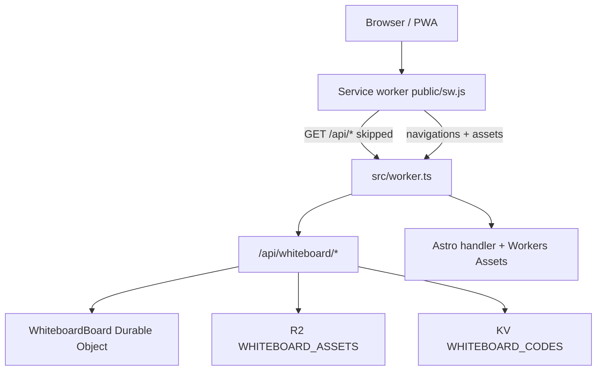

# Architecture

St. Cecilia Technology is an **Astro 7** site deployed as a **Cloudflare Worker** with static assets. Pages are prerendered HTML; the same Worker hosts live `/api/whiteboard/*` endpoints (Excalidraw WebSocket sync, R2 media, KV share codes, Clerk-backed library APIs).

**Live domain:** `scsfoxchase.tech`  
**Worker name:** `scsfoxchase-tech`  
**Config:** `wrangler.jsonc`, `astro.config.mjs`, custom entry `src/worker.ts`

## Runtime model

| Layer | Role |
|-------|------|
| **Astro** | Pages, layouts, content collections, React islands; `output: 'server'` so the Cloudflare adapter bundles a Worker |
| **Prerender** | Every route under `src/pages/` exports `prerender = true` — shipped as static HTML under `dist/client/` |
| **Worker entry** | `src/worker.ts` — routes `/api/whiteboard/*` first, then delegates everything else to `@astrojs/cloudflare/handler` |
| **Workers Assets** | Binding `ASSETS`, directory `./dist/client` (`not_found_handling: 404-page`, `html_handling: drop-trailing-slash`) |

This is **not** a Cloudflare Pages project. Do not restore Pages SPA rewrites or an empty Pages publish root.



## Cloudflare bindings

Product resource family for whiteboards: **`scsfoxchase-tech_whiteboards`**.

| Binding | Type | Resource | Purpose |
|---------|------|----------|---------|
| `ASSETS` | Workers Assets | `./dist/client` | Prerendered pages and static files |
| `WHITEBOARDS` | Durable Object | Class `WhiteboardBoard` (SQLite) | Per-board sync room; `idFromName(uuid)` |
| `WHITEBOARD_ASSETS` | R2 | Bucket `scsfoxchase-tech-whiteboards` | Media blobs + cloud library JSON indexes |
| `WHITEBOARD_CODES` | KV | Share-code namespace | `code:{A1B2}` → board UUID (TTL 12h) |

**R2 naming:** Bucket names cannot contain `_`. The live bucket is hyphenated (`scsfoxchase-tech-whiteboards`); the product family spelling keeps the underscore.

**Clerk (not a Wrangler binding):** Worker verifies sessions with `@clerk/backend` using `CLERK_SECRET_KEY` and `PUBLIC_CLERK_PUBLISHABLE_KEY`. Custom Frontend API host: `clerk.scsfoxchase.tech`.

DO migration tag: `whiteboard-v1` (`new_sqlite_classes: ["WhiteboardBoard"]`).

## Request flow

### Static site and prerendered pages

1. Request hits Worker `fetch` in `src/worker.ts`.
2. If the path is not a whiteboard API route, the entry calls `handle(request, env, ctx)` from `@astrojs/cloudflare/handler`.
3. The handler serves prerendered HTML and assets from Workers Assets (`dist/client/`).

Board URLs use a path rewrite so one prerendered shell serves every UUID:

- **Production:** `public/_redirects` — `/board/*` → `/board` (200)
- **Dev:** `src/middleware.ts` rewrites `/board/{uuid}` → `/board` while the browser URL keeps the UUID for client JS

### `/api/whiteboard/*`

`src/worker.ts` matches paths in this order and returns when a handler responds:

| Path pattern | Module | Behavior |
|--------------|--------|----------|
| `/api/whiteboard/library…` | `worker/libraryRoutes.ts` | Cloud board/asset indexes (Clerk session) |
| `/api/whiteboard/join…` or `/api/whiteboard/boards/:uuid/code` | `worker/codeRoutes.ts` | Share-code resolve / mint / revoke (KV + DO) |
| `/api/whiteboard/boards/:uuid/meta` | DO | Saved-to-library + Google Owner (24h TTL) |
| `/api/whiteboard/boards/:uuid/participants/…` | `worker/participantRoutes.ts` | Per-session roles (Owner / Manager) |
| `/api/whiteboard/boards/:uuid/force-follow` | `worker/forceFollowRoutes.ts` | Follow Me / force-follow (camera lock) |
| `/api/whiteboard/assets…` | `worker/assetRoutes.ts` | R2 PUT/GET/DELETE / claim |
| `/api/whiteboard/connect/:uuid` | DO (`idFromName` → `stub.fetch`) | WebSocket upgrade → `WhiteboardBoard` |

Connect requires a valid UUID and `Upgrade: websocket`; otherwise the Worker returns `400` or `426`.

Everything else falls through to the Astro asset handler.

### Auth and ownership (whiteboard)

- **Scratch (signed out create):** live Durable Object; ephemeral Owner via host secret; canvas files under `temp:{boardId}` (24h). Not in a library.
- **Signed in (Google via Clerk):** owner key `google:{accountId}` (Google OAuth `sub` preferred, else Clerk user id); Recents / Library / Assets from R2 `library/{ownerKey}/boards.json` and `library/{ownerKey}/assets.json`. Signed-in create autosaves; that account is Owner.
- Join by code/link/UUID works without an account (default **Viewer**). Join does not write Recents.
- UI: `@clerk/react` header island (`ClerkAuth.tsx`). Worker auth helpers live in `worker/clerkAuth.ts`. Canvas: `WhiteboardCanvas.tsx` (Excalidraw 0.18.1).

### Asset and share-code storage

- R2 object keys for media: `assets/{ownerKey}/{assetId}` (`google:` when saved; `temp:{boardId}` when unsaved)
- Share codes: KV `code:{A1B2}` → board id (12h TTL); DO stores `activeCode` and alarm-driven Open/Closed cleanup
- Same-origin video player: `/whiteboard-player` (Worker sets `X-Frame-Options: SAMEORIGIN`)

## PWA service worker boundary

`public/sw.js` (cache name `st-cecilia-tech-astro-v17`):

| Request | Strategy |
|---------|----------|
| Non-GET | Ignored |
| Cross-origin | Ignored |
| Path starts with `/api/` | **Not intercepted** (required for WebSocket upgrades and Worker APIs) |
| `navigate` | Network-first; on failure serve cached `/offline` |
| Same-origin assets | Network-first with cache put on 200; cache match on failure |

Canonical offline page: `/offline` (`src/pages/offline.astro`), precached on install. PWA metadata: `public/manifest.json`.

## Astro configuration highlights

From `astro.config.mjs`:

- `site: 'https://scsfoxchase.tech'`
- Adapter: `@astrojs/cloudflare` with `imageService: 'passthrough'`
- `trailingSlash: 'never'`, `build.format: 'file'`
- Session driver: in-memory LRU (no Astro SESSION KV binding)
- Redirects: `/games.html` → `/games`, `/newgames` → `/games`, `/hub` → `/`, `/offline.html` → `/offline`, and related legacy paths
- Integration: `@astrojs/react`

## High-level module map

```
src/
├── pages/                 # File-based routes (all prerendered)
│   ├── index.astro        # /
│   ├── games.astro        # /games
│   ├── help.astro         # /help
│   ├── forms.astro        # /forms (catalog)
│   ├── guides.astro       # /guides (catalog)
│   ├── form/              # /form/*
│   ├── guide/             # /guide/{slug}
│   ├── inventory.astro    # /inventory
│   ├── whiteboard.astro   # /whiteboard hub
│   ├── board.astro        # /board shell (+ rewrite for /board/{uuid})
│   ├── whiteboard-player.astro  # same-origin MP4/WebM player
│   ├── offline.astro      # /offline
│   ├── oldgames.astro     # legacy catalog
│   └── 404.astro
├── layouts/
│   └── BaseLayout.astro   # Shared chrome, CSS imports, SW registration hooks
├── components/            # Astro UI + React islands
│   ├── Header.astro, AppLauncher.astro, GamesCatalog.astro, …
│   ├── ClerkAuth.tsx      # Clerk SignIn / UserButton
│   └── WhiteboardCanvas.tsx  # Live board + Excalidraw collab
├── content/
│   └── games/*.json       # Games content collection
├── content.config.ts      # Collection schema (zod)
├── data/
│   └── trending.json      # Featured game IDs for carousel
├── lib/                   # Shared client helpers (whiteboard identity, codes, assets, …)
├── scripts/               # Browser scripts (theme, catalog, hub, icons, …)
├── styles/                # Plain CSS (no framework)
├── middleware.ts          # Dev rewrite /board/{uuid} → /board
├── worker.ts              # Cloudflare Worker entry (export default + WhiteboardBoard)
└── worker/                # Whiteboard API + DO implementation
    ├── WhiteboardBoard.ts
    ├── assetRoutes.ts
    ├── codeRoutes.ts
    ├── libraryRoutes.ts
    ├── participantRoutes.ts
    ├── forceFollowRoutes.ts
    ├── clerkAuth.ts
    └── shareCode.ts
```

| Path | Responsibility |
|------|----------------|
| `src/pages/` | Routes and page composition |
| `src/components/` | Reusable Astro components and React islands |
| `src/worker.ts` + `src/worker/` | All live whiteboard HTTP/WebSocket logic and Durable Object class |
| `src/lib/` | Client-side whiteboard helpers shared by hub/board scripts |
| `src/content/` | Build-time game data (Astro content collection) |
| `src/scripts/` | DOM/UI behavior loaded by pages |
| `src/styles/` | Global and page CSS |
| `public/` | Static assets, `_headers`, `_redirects`, `sw.js`, images |

## Security and headers

`public/_headers` is the sole source of security and cache headers (CSP, HSTS, X-Frame-Options, and related). CSP allows Clerk and Google OAuth hosts used by sign-in, same-origin Whiteboard WebSocket/assets/fonts, and YouTube/Vimeo `frame-src` for canvas embeds. See deployment docs for production checklist items.

## Related docs

- [conventions.md](./conventions.md) — UI and content rules
- [deployment.md](./deployment.md) — build and Wrangler
- [environment.md](./environment.md) — secrets and env vars
- [pwa-and-offline.md](./pwa-and-offline.md) — service worker detail
- [whiteboard/README.md](./whiteboard/README.md) — whiteboard subsystem
