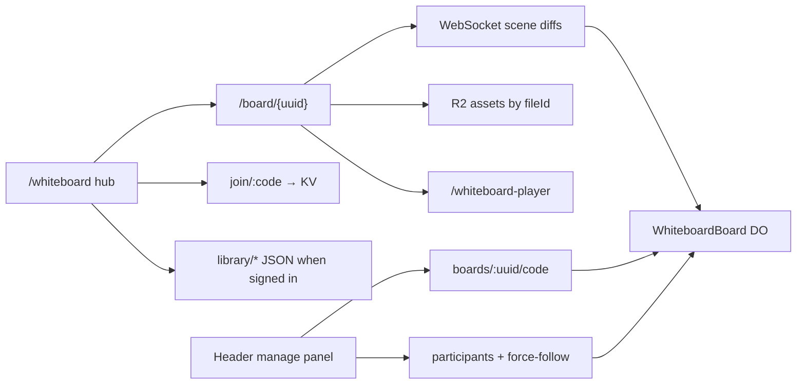

# Whiteboard

Collaborative whiteboards for St. Cecilia Technology: create and join boards from a hub, sync live canvases over Cloudflare Durable Objects, store media in R2, and manage People / share codes from the board header.

The product name is **Whiteboard**. The editor is stock **Excalidraw 0.18.1** (MIT). There is no tldraw license key.

Production surface: **https://scsfoxchase.tech** (Worker `scsfoxchase-tech`).

## Feature map

| Area | What it does | Doc |
|------|----------------|-----|
| Hub + board UI | Create / join; signed-in Recents, Assets, Library; live `/board/{uuid}` canvas + header manage panel. Share-code joiners land as **Viewer** unless **Class can edit** is On; UUID-only stays **Viewer** | [hub-and-board.md](./hub-and-board.md) |
| Sync + storage | Native WebSocket → DO `WhiteboardBoard`; Excalidraw scene JSON in SQLite; R2 files by `fileId` | [sync-storage.md](./sync-storage.md) |
| Auth + library | Clerk Google sign-in; cloud-only Recents / Library / Assets; scratch boards expire in 24h | [auth-libraries.md](./auth-libraries.md) |
| Share codes | Short `A1B2C3D4` codes in KV; Open / Closed / Copy / New; hub join. A code opens the board; join is view-only unless **Class can edit** is On. UUID-only stays **Viewer**. A join code alone does not mean students can draw | [share-codes.md](./share-codes.md) |
| People + permissions | Owner / Manager / Editor / Viewer; Follow (pan to unfollow); Follow Me (camera locked). **Class can edit** (share-code joiners land as Editor when On) or set **Editor** on People. UUID-only stays **Viewer** | [people-permissions.md](./people-permissions.md) |

## Routes

| Route | Source | Role |
|-------|--------|------|
| `/whiteboard` | `src/pages/whiteboard.astro` | Hub — create, join; Recents / Assets / Library when signed in |
| `/board/{uuid}` | `src/pages/board.astro` (+ rewrite) | Live board — site header + Excalidraw canvas |
| `/whiteboard-player` | `src/pages/whiteboard-player.astro` | Same-origin MP4/WebM player (iframe on the canvas) |
| `/api/whiteboard/connect/:uuid` | `src/worker.ts` → DO | WebSocket upgrade for Excalidraw collab |
| `/api/whiteboard/join/:code` | `src/worker/codeRoutes.ts` → KV | Resolve share code → board UUID |
| `/api/whiteboard/boards/:uuid/code` | DO + KV | GET / POST / DELETE share code |
| `/api/whiteboard/boards/:uuid/meta` | DO | GET / PATCH saved-to-library + Google Owner (24h TTL) |
| `/api/whiteboard/boards/:uuid/participants/:sessionId` | DO | PATCH participant role (Owner / Manager) |
| `/api/whiteboard/boards/:uuid/force-follow` | DO | PATCH Follow Me / force-follow (Owner / Manager) |
| `/api/whiteboard/assets/:ownerKey/:assetId` | R2 | PUT / GET / DELETE media |
| `/api/whiteboard/assets/claim` | R2 | Move `temp:{boardId}` objects under `google:{id}` |
| `/api/whiteboard/library/boards` | R2 JSON | Signed-in board index (Clerk) |
| `/api/whiteboard/library/assets` | R2 JSON | Signed-in asset index (Clerk) |

`/board/{uuid}` is served by rewriting to the prerendered `/board` shell (`public/_redirects`, `src/middleware.ts` in `astro dev`). The client reads the UUID from the path.

## Cloudflare bindings

Product family spelling: `scsfoxchase-tech_whiteboards` (underscore). R2 bucket names cannot use `_`, so the bucket is hyphenated.

| Binding | Resource | Config |
|---------|----------|--------|
| `WHITEBOARDS` | Durable Object class `WhiteboardBoard` (SQLite) | `wrangler.jsonc` → `durable_objects` |
| `WHITEBOARD_ASSETS` | R2 bucket `scsfoxchase-tech-whiteboards` | Media + cloud library JSON |
| `WHITEBOARD_CODES` | KV namespace | `code:{A1B2C3D4}` → `{ boardId, exp }` (TTL 12h) |

Clerk secrets / vars (not in `wrangler.jsonc`): `CLERK_SECRET_KEY`, `PUBLIC_CLERK_PUBLISHABLE_KEY`, optional `PUBLIC_CLERK_ALLOWED_DOMAINS`. See `.dev.vars.example` and `DEPLOYMENT.md`. No whiteboard license key.

## Architecture sketch

## Chromebook notes

- Excalidraw fonts are self-hosted (`window.EXCALIDRAW_ASSET_PATH = '/excalidraw/'` before mount). `predev` / `prebuild` copy them from the npm package into `public/excalidraw/fonts` so Vite does not inline ~20 MB of font files.
- Hub layout compresses under `@media (max-height: 800px)` in `src/styles/whiteboard.css` so Recents / Library still fit 11.6" Chromebooks without page scroll.
- PWA service worker never intercepts `/api/*`, so the collab WebSocket is not cached or rewritten.

## Key files

| Path | Role |
|------|------|
| `src/worker.ts` | Worker entry — routes `/api/whiteboard/*`, Astro asset handler, player `X-Frame-Options` |
| `src/worker/WhiteboardBoard.ts` | DO: scene persist, codes, roles, Follow, 24h unsaved TTL |
| `src/components/WhiteboardCanvas.tsx` | React island — Excalidraw, WebSocket, files, roles |
| `src/components/Header.astro` | Board manage panel markup + Clerk island |
| `src/scripts/whiteboard-hub.ts` | Hub create / join / lists |
| `src/scripts/whiteboard-menu.ts` | Manage panel behavior |
| `src/scripts/whiteboard-library.ts` | Cloud library, scratch host secret, join parsing |
| `src/lib/whiteboard-*.ts` | Sync protocol, assets, codes, cloud client, identity, People |
| `scripts/copy-excalidraw-fonts.mjs` | Self-host Excalidraw fonts |
| `wrangler.jsonc` | DO / R2 / KV bindings |

## Related project docs

- `AGENTS.md` — project overview (whiteboard sections)
- `DEPLOYMENT.md` — Workers Builds, Clerk Frontend API `clerk.scsfoxchase.tech`
- `tldraw-to-excalidraw.md` — rewrite spec (**shipped**; research appendix is historical)
