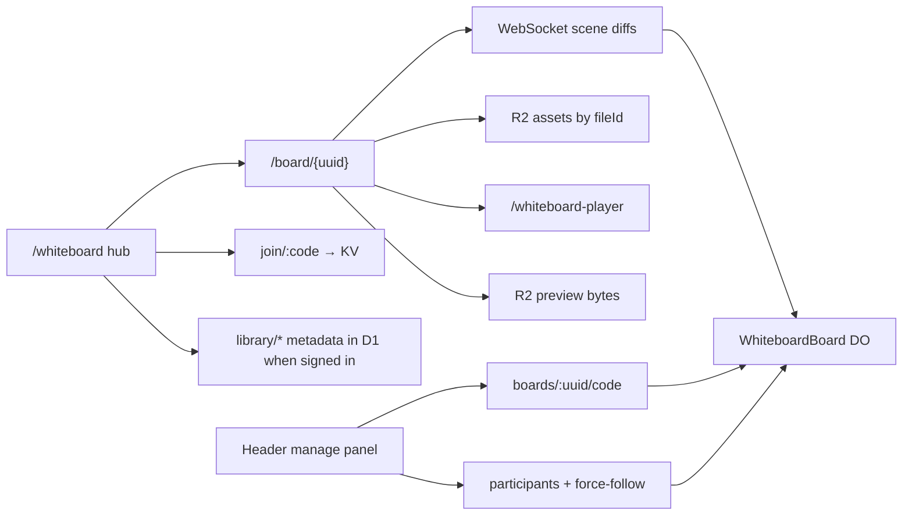

# Whiteboard

> **Current storage boundary:** The post-`81242d2` image/R2 write redesign was abandoned. New image/video insertion is temporarily disabled. Existing media remains readable from legacy `assets/{ownerKey}/{assetId}` objects and from read-only board-scoped `boards/{boardId}/assets/{fileId}` objects. Board-scoped GET/HEAD works; PUT/DELETE return 405. Scene data remains in the board Durable Object's SQLite store; signed-in Library / Recents / Assets metadata is in D1. Historical R2 library JSON indexes remain read-only migration sources.

Collaborative whiteboards for St. Cecilia Technology: create and join boards from a hub, sync live canvases over Cloudflare Durable Objects, keep signed-in library metadata in D1, retain previews/legacy media in R2, and manage People / share codes from the board header.

The product name is **Whiteboard**. The editor is stock **Excalidraw 0.18.1** (MIT). There is no tldraw license key.

Production surface: **https://scsfoxchase.tech** (Worker `scsfoxchase-tech`).

## Feature map

| Area | What it does | Doc |
|------|----------------|-----|
| Hub + board UI | Create / join; signed-in Recents, Assets, Library; live `/board/{uuid}` canvas + header manage panel. Share-code joiners land as **Editor**; UUID-only stays **Viewer**. **Group Edit** gates whether Editors can draw | [hub-and-board.md](./hub-and-board.md) |
| Sync + storage | Native WebSocket → DO `WhiteboardBoard`; Excalidraw scene JSON in SQLite; legacy and read-only-compatible R2 files | [sync-storage.md](./sync-storage.md) |
| R2 rollback + usage postmortem | Why the image redesign was removed; Cloudflare quota incident, retained safeguards, recovery runbook, and future R2 rules | [r2-rollback-cloudflare-usage.md](./r2-rollback-cloudflare-usage.md) |
| Auth + library | Clerk Google sign-in; cloud-only Recents / Library / Assets; scratch boards expire in 24h | [auth-libraries.md](./auth-libraries.md) |
| Operations | D1 migrations; read-only R2 scan/import; resumable import; no-clobber D1 export and rollback | [d1-library-operations.md](./d1-library-operations.md) |
| Share codes | Permanent `1A2B3C4D` codes in KV (legacy `1A2B` still joins); Copy Code / Copy Link; hub join. Share-code joiners land as **Editor**. UUID-only stays **Viewer**. Group Edit Off = Editors view-only | [share-codes.md](./share-codes.md) |
| People + permissions | Owner / Manager / Editor / Viewer; Follow (eyes, pan to unfollow); Follow User (camera locked). **Group Edit** is a live draw gate. UUID-only stays **Viewer** | [people-permissions.md](./people-permissions.md) |

## Routes

| Route | Source | Role |
|-------|--------|------|
| `/whiteboard` | `src/pages/whiteboard.astro` | Hub — create, join; Recents / Assets / Library when signed in |
| `/board/{uuid}` | `src/pages/board.astro` (+ rewrite) | Live board — site header + Excalidraw canvas |
| `/whiteboard-player` | `src/pages/whiteboard-player.astro` | Same-origin MP4/WebM player (iframe on the canvas) |
| `/api/whiteboard/connect/:uuid` | `src/worker.ts` → DO | WebSocket upgrade for Excalidraw collab |
| `/api/whiteboard/join/:code` | `src/worker/codeRoutes.ts` → KV | Resolve share code → board UUID |
| `/api/whiteboard/boards/:uuid/code` | DO + KV | GET / POST share code (mint once); DELETE internal revoke |
| `/api/whiteboard/boards/:uuid/meta` | DO | GET / PATCH saved-to-library + Google Owner (24h TTL) |
| `/api/whiteboard/boards/:uuid/participants/:sessionId` | DO | PATCH participant role (Owner / Manager) |
| `/api/whiteboard/boards/:uuid/force-follow` | DO | PATCH Follow User / force-follow (Owner / Manager) |
| `/api/whiteboard/boards/:uuid/assets/:fileId` | R2 | Read-only compatibility media: GET / HEAD; PUT / DELETE return 405 |
| `/api/whiteboard/assets/:ownerKey/:assetId` | R2 | Legacy owner-key PUT / GET / DELETE media |
| `/api/whiteboard/assets/claim` | R2 | Move `temp:{boardId}` objects under `google:{id}` |
| `/api/whiteboard/library/boards` | D1 | Signed-in board metadata (Clerk) |
| `/api/whiteboard/library/assets` | D1 | Signed-in asset metadata (Clerk) |

`/board/{uuid}` is served by rewriting to the prerendered `/board` shell (`public/_redirects`, `src/middleware.ts` in `astro dev`). The client reads the UUID from the path.

## Connection and protocol guardrails

The Worker validates canonical UUID board/session identifiers and applies two admission gates before resolving a Durable Object. The deployed policy allows 600 upgrades per trusted `CF-Connecting-IP` per 60 seconds and 240 per canonical board UUID plus trusted IP. Local/test fallback buckets enforce both layers, expire, and are pruned at a hard maximum of 4096 keys. Each board admits at most 64 total sockets and 32 pending-auth sockets; pending authentication expires after approximately 30 seconds without a per-socket storage alarm.

An arbitrary `X-Board-Host` on a new UUID is read-only and cannot create metadata, an alarm, or a share code. The creating browser must send a valid host proof in its first `wb:auth` message. Signed-in tabs without a JWT remain pending until a token arrives. UUID-only guests are Viewers, share-code guests are Editors subject to Group Edit, Clerk owners/managers retain their roles, and signed-out creators are ephemeral scratch Owners. Scene mutations use mutation IDs and `scene:ack`; transient persistence failures retry on bounded reconnect backoff, while malformed or oversized payloads are terminal and visible. Frames and scenes are bounded by UTF-8 bytes and the 4,000-element / 2,000,000-byte scene limits.

## Cloudflare bindings

Product family spelling: `scsfoxchase-tech_whiteboards` (underscore). R2 bucket names cannot use `_`, so the bucket is hyphenated.

| Binding | Resource | Config |
|---------|----------|--------|
| `WHITEBOARDS` | Durable Object class `WhiteboardBoard` (SQLite) | `wrangler.jsonc` → `durable_objects` |
| `WHITEBOARD_ASSETS` | R2 bucket `scsfoxchase-tech-whiteboards` | Previews and legacy media; historical library JSON source indexes are read-only |
| `WHITEBOARD_CODES` | KV namespace | `code:{CODE}` → `{ boardId }` (no TTL) |
| `WHITEBOARD_LIBRARY` | D1 database `scsfoxchase-tech-whiteboard-library` | Signed-in Library / Recents / Assets metadata only; preview uses separate configured preview ID |
| `WHITEBOARD_CONNECT_LIMITER` | Rate Limiting | 600 connection admissions / 60 seconds per trusted `CF-Connecting-IP` |
| `WHITEBOARD_BOARD_CONNECT_LIMITER` | Rate Limiting | 240 connection admissions / 60 seconds per canonical board UUID plus trusted IP |

Clerk secrets / vars (not in `wrangler.jsonc`): `CLERK_SECRET_KEY`, `PUBLIC_CLERK_PUBLISHABLE_KEY`, optional `PUBLIC_CLERK_ALLOWED_DOMAINS`. See `.dev.vars.example` and `DEPLOYMENT.md`. No whiteboard license key.

## Architecture sketch

## Chromebook notes

- Excalidraw fonts are self-hosted (`window.EXCALIDRAW_ASSET_PATH = '/excalidraw/'` before mount). `predev` / `prebuild` copy them from the npm package into `public/excalidraw/fonts` so Vite does not inline ~20 MB of font files.
- Hub layout compresses under `@media (max-height: 800px)` in `src/styles/whiteboard.css` so Recents / Library still fit 11.6" Chromebooks without page scroll.
- PWA service worker never intercepts `/api/*`, so the collab WebSocket is not cached or rewritten.

## Key files

| Path | Role |
|------|------|
| `src/worker.ts` | Worker entry — routes `/api/whiteboard/*`, Astro asset handler, player `X-Frame-Options` |
| `src/worker/WhiteboardBoard.ts` | DO: scene persist, codes, roles, Follow, 24h unsaved TTL |
| `src/worker/connectAdmission.ts` | Pre-DO Rate Limiting admission and bounded local/test fallback |
| `src/worker/libraryStore.ts` | D1 library metadata and read-only R2 source import |
| `src/worker/adminLibraryRoutes.ts` | Authenticated bounded scan/import/export operations |
| `src/components/WhiteboardCanvas.tsx` | React island — Excalidraw, WebSocket, files, roles |
| `src/components/Header.astro` | Board manage panel markup + Clerk island |
| `src/scripts/whiteboard-hub.ts` | Hub create / join / lists |
| `src/scripts/whiteboard-menu.ts` | Manage panel behavior |
| `src/scripts/whiteboard-library.ts` | Cloud library, scratch host secret, join parsing |
| `src/lib/whiteboard-*.ts` | Sync protocol, legacy/read-only media helpers, assets, codes, cloud client, identity, People |
| `scripts/copy-excalidraw-fonts.mjs` | Self-host Excalidraw fonts |
| `wrangler.jsonc` | DO / D1 / R2 / KV / Rate Limiting bindings and observability |

## Related project docs

- `AGENTS.md` — project overview (whiteboard sections)
- `DEPLOYMENT.md` — Workers Builds, Clerk Frontend API `clerk.scsfoxchase.tech`
- `tldraw-to-excalidraw.md` — rewrite spec (**shipped**; research appendix is historical)
