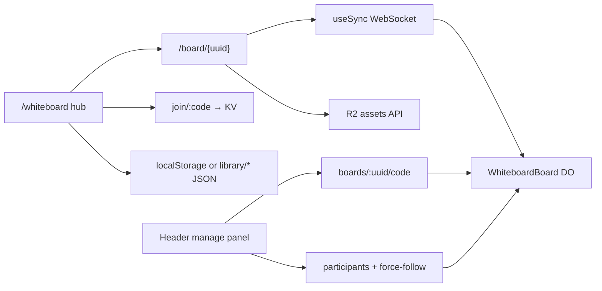

# Whiteboard

Collaborative whiteboards for St. Cecilia Technology: create and join boards from a hub, sync live canvases over Cloudflare Durable Objects, store media in R2, and manage People / share codes from the board header.

Production surface: **https://scsfoxchase.tech** (Worker `scsfoxchase-tech`).

## Feature map

| Area | What it does | Doc |
|------|----------------|-----|
| Hub + board UI | Create / join, Recents, Assets, Library; live `/board/{uuid}` canvas + header manage panel | [hub-and-board.md](./hub-and-board.md) |
| Sync + storage | `@tldraw/sync` WebSocket → DO `WhiteboardBoard`; document SQLite; R2 binaries | [sync-storage.md](./sync-storage.md) |
| Auth + libraries | Clerk Google sign-in; dual local/cloud Recents / Library / Assets; owner keys | [auth-libraries.md](./auth-libraries.md) |
| Share codes | Short `A1B2` codes in KV; Open / Closed / Copy / New; hub join | [share-codes.md](./share-codes.md) |
| People + permissions | Presence list, Follow, Edit switches, Everyone follows me, readonly | [people-permissions.md](./people-permissions.md) |

## Routes

| Route | Source | Role |
|-------|--------|------|
| `/whiteboard` | `src/pages/whiteboard.astro` | Hub — create, join, Recents, Assets, Library |
| `/board/{uuid}` | `src/pages/board.astro` (+ rewrite) | Live board — site header + tldraw sync canvas |
| `/api/whiteboard/connect/:uuid` | `src/worker.ts` → DO | WebSocket upgrade for `@tldraw/sync` |
| `/api/whiteboard/join/:code` | `src/worker/codeRoutes.ts` → KV | Resolve share code → board UUID |
| `/api/whiteboard/boards/:uuid/code` | DO + KV | GET / POST / DELETE share code |
| `/api/whiteboard/boards/:uuid/participants/:sessionId` | DO | PATCH guest `canEdit` (host secret) |
| `/api/whiteboard/boards/:uuid/force-follow` | DO | PATCH Everyone follows me (host secret) |
| `/api/whiteboard/assets/:ownerKey/:assetId` | R2 | PUT / GET / DELETE media |
| `/api/whiteboard/library/boards` | R2 JSON | Signed-in board index (Clerk) |
| `/api/whiteboard/library/assets` | R2 JSON | Signed-in asset index (Clerk) |

`/board/{uuid}` is served by rewriting to the prerendered `/board` shell (`public/_redirects`, `src/middleware.ts` in `astro dev`). The client reads the UUID from the path.

## Cloudflare bindings

Product family spelling: `scsfoxchase-tech_whiteboards` (underscore). R2 bucket names cannot use `_`, so the bucket is hyphenated.

| Binding | Resource | Config |
|---------|----------|--------|
| `WHITEBOARDS` | Durable Object class `WhiteboardBoard` (SQLite) | `wrangler.jsonc` → `durable_objects` |
| `WHITEBOARD_ASSETS` | R2 bucket `scsfoxchase-tech-whiteboards` | Media + cloud library JSON |
| `WHITEBOARD_CODES` | KV namespace | `code:{A1B2}` → `{ boardId, exp }` (TTL 12h) |

Clerk secrets / vars (not in `wrangler.jsonc`): `CLERK_SECRET_KEY`, `PUBLIC_CLERK_PUBLISHABLE_KEY`, optional `PUBLIC_CLERK_ALLOWED_DOMAINS`. See `.dev.vars.example` and `DEPLOYMENT.md`.

## Architecture sketch

## Key files

| Path | Role |
|------|------|
| `src/worker.ts` | Worker entry — routes `/api/whiteboard/*`, Astro asset handler |
| `src/worker/WhiteboardBoard.ts` | DO: sync room, codes, participants, force-follow |
| `src/components/TldrawBoard.tsx` | React island — `useSync`, assets, custom messages |
| `src/components/Header.astro` | Board manage panel markup + Clerk island |
| `src/scripts/whiteboard-hub.ts` | Hub create / join / lists |
| `src/scripts/whiteboard-menu.ts` | Manage panel behavior |
| `src/scripts/whiteboard-library.ts` | Local library, host secret, dual-mode board helpers |
| `src/lib/whiteboard-*.ts` | Assets, codes, cloud client, identity, people helpers |
| `wrangler.jsonc` | DO / R2 / KV bindings |

## Related project docs

- `AGENTS.md` — project overview (whiteboard sections)
- `DEPLOYMENT.md` — Workers Builds, Clerk Frontend API `clerk.scsfoxchase.tech`
