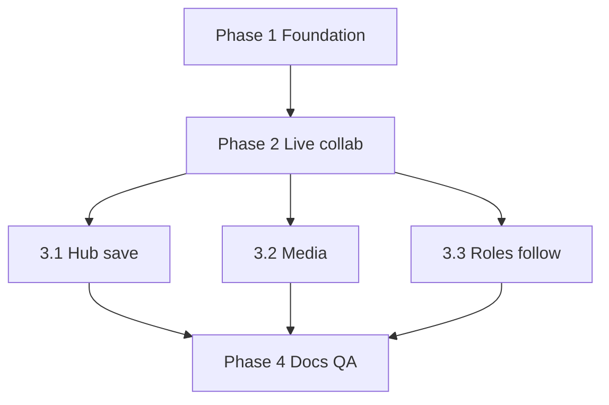

# tldraw → Excalidraw

Canonical spec for replacing the St. Cecilia whiteboard. Research is retained below the locked decisions. **Implement from “Locked decisions” and “Task list,” not from older “keep dual library / archive old boards” notes.**

| | |
|---|---|
| **Date** | 2026-08-13 |
| **Status** | Decided — ready to implement |
| **Outgoing editor** | `tldraw` / `@tldraw/sync` / `@tldraw/sync-core` / `@tldraw/tlschema` **5.3.0** — **delete entirely** |
| **Incoming editor** | `@excalidraw/excalidraw` **0.18.1** (MIT) — pin this version |
| **Why** | tldraw hobby license may not renew. We are done with that vendor. No users in production yet; test boards and unfinished Help canvases may be destroyed. |

---

## Locked decisions

These override the research tables where they conflict.

### Wipe

- Remove **all** tldraw from the repo: npm deps, `TldrawBoard`, `GuideDiagram`, `src/content/guides/*.tldraw`, `PUBLIC_TLDRAW_LICENSE_KEY`, CSP `cdn.tldraw.com`, docs/comments that treat tldraw as current.
- No converters. No dual-editor period. No archived tldraw rooms.
- Production DO rooms, R2 whiteboard media, KV share codes, and localStorage libraries may be emptied. Only test data exists.
- Help title cards: **no live canvas**. Use the ordinary title/description layout (the tldraw title-card experiment never shipped properly).

### Canvas

- Stock Excalidraw elements only (draw, shapes, arrows, text, frames, images, stock embeds).
- No tldraw pages, notes-as-tldraw, or custom shapes.
- **Images + GIF:** native Excalidraw image files, bytes in R2, `fileId` on the element.
- **YouTube / Vimeo:** stock Excalidraw embeds.
- **Other video (MP4/WebM):** small **same-origin player** wrapping the R2 object (not a raw MP4 iframe).
- Not in v1: live cursors, kick, board thumbnails, hub-asset drag-drop, generic office/PDF files as canvas objects.

### Create / save / owner

- **Create** works signed **in or out**.
- **Local saving is gone.** No `localStorage` board library, no signed-out Recents/Library/Assets indexes.
- **Save / reopen from Library** requires Google sign-in. Signed-in **create autosaves** to the cloud library. That Google account is **Owner**.
- Signed-out create is a **live scratch board** (URL + DO). The creating browser is **ephemeral Owner** so roles and Follow still work. It is **not** in anyone’s library.
- “Leave and lose work” means **never saved to the cloud library**, not “destroy on refresh.” Chromebooks refresh. Keep the scene in the DO; **delete unsaved boards and their R2 objects after 24 hours**.
- Sign in on a scratch board and Save: that Google account **claims Owner**, temp R2 files move under `google:{accountId}`, 24h TTL comes off.

### Join / guests

- Anyone can join by share code, link, or UUID with **no account**.
- Signed-out joiners are **Viewer** by default, with a **generated display name** so the Owner can tell people apart.
- Guest identity sticks on that browser (`deviceInstallId`). New browser = new guest.
- Owner/Manager can promote/demote that person on this board.

### Roles

| Role | Canvas | Roles UI | Follow force |
|---|---|---|---|
| **Owner** | Edit | Grant/revoke Manager, Editor, Viewer. Cannot be demoted. | Yes (self or someone else) |
| **Manager** | Edit | Editor/Viewer only. Cannot grant Manager or touch Owner. | Yes (self or someone else) |
| **Editor** | Edit | No | Voluntary Follow only |
| **Viewer** | View only (`viewModeEnabled` **and** DO drops their writes) | No | Voluntary Follow only |

Only **Owner** can grant/revoke **Manager** (co-teachers / co-presenters).

### Follow

- **Follow this person:** button on each People row. Anyone may follow someone for themselves.
- **Follow Me / force follow:** Owner or Manager sets the room (or a person) to follow a target — themselves or a student showing work. Same camera-lock machinery, different target. Re-assert if the guest pans away (Excalidraw follow breaks on pan/zoom).
- Live **cursors are not v1.** Do not block on them.

### Share / hub / nav

- Keep `A1B2` share codes (Open/Closed, 12h, rotate, copy link).
- Keep Clerk Google + allowlist.
- Recents / Library / Assets hub lists: **signed-in cloud only**.
- Unhide the header Whiteboard control (and manage panel) as part of this work. Hide again only if the replacement fails.

### Architecture (do this; do not invent another stack)

- Astro `client:only="react"` Excalidraw island.
- One Durable Object per board UUID. Native WebSocket. Persist plaintext `{ elements, appState }` with `serializeAsJSON(..., "database")`. Files in R2 by `fileId`.
- Live merge: element diffs + periodic full resync + `reconcileElements`. Remote applies use `captureUpdate: NEVER`.
- Self-host Excalidraw fonts (`EXCALIDRAW_ASSET_PATH`). Do not inline fonts into the JS bundle.
- **Do not use:** `excalidraw-room` on Workers, Firebase, `oss-collab`, `json.excalidraw.com`, Excalidraw+, Liveblocks, Yjs (unless a later phase explicitly chooses it), `@excalidraw/excalidraw@next`.

### v1 is complete when

- Two Chromebooks draw on the same board; both see shapes; reload still has the scene.
- Signed-out create works; leaving without Save means it is not in a library and dies in 24h.
- Signed-in create is in the cloud library; Owner is that account.
- Join-by-code works; guests are Viewers with generated names; Owner/Manager can set Editor/Viewer/Manager (rules above).
- Viewers cannot mutate the document (UI + server).
- Follow person + force follow / Follow Me work.
- Images/GIFs on the canvas via R2; YouTube embeds; MP4/WebM via the player wrapper; unsigned/unsaved media expires in 24h.
- Zero tldraw in the repo or Worker. Header Whiteboard is visible.
- `npm run build` succeeds.

---

## Verdict

Excalidraw solves the license problem. It is not a drop-in. We **rewrite the room and canvas**, keep the Worker/R2/KV/Clerk shape, and **delete** tldraw and local libraries.

| Layer | What we do |
|---|---|
| Drawing editor | Stock Excalidraw 0.18.1 |
| Hub shell, share codes, Clerk, R2 bucket | Keep the routes/bindings; change save/library rules |
| People / roles / Follow | Rebuild on Excalidraw APIs + DO |
| Live durable sync | **We write it** on the existing DO |
| tldraw documents / Help canvases / local save | **Delete** |

---

## What we have today (outgoing)

The product is two layers: **our classroom shell** and **stock tldraw**. The canvas is a stock `<Tldraw />` — no custom tools, shapes, or UI overrides.

The header Whiteboard chip is `hidden` in `Header.astro`. Routes still work. The manage panel is implemented but unreachable while that wrapper is hidden. Clerk stays in the global header. No homepage launcher tile.

### Classroom shell

| Feature | Status | Notes |
|---|---|---|
| Hub create / join by `A1B2` / URL / UUID | Shipped | `/whiteboard` |
| Recents (8), Library, rename, delete index | Shipped | **Replace:** cloud-only; delete local library |
| Dual libraries (localStorage vs R2 + Clerk) | Shipped | **Replace:** signed-in cloud only |
| Share Open/Closed, 12h TTL, rotate, copy link | Shipped | Keep |
| Host secret on the creating browser | Shipped | Keep as **ephemeral Owner** for scratch boards; saved boards use Google Owner |
| People list, per-guest Edit, Follow, Follow Me | Shipped | Rebuild as four roles + retargetable force-follow |
| R2 images/videos, 8 MB cap, owner-scoped keys | Shipped | Keep API; adapt to Excalidraw files + 24h temp prefix |
| PWA: `/api/*` never intercepted | Shipped | Keep |
| Guide title-card tldraw | Stub | **Delete** |

### tldraw-owned (delete)

- `@tldraw/sync` + `TLSocketRoom` + DO SQLite `tldraw_*` tables
- Native video shapes, pages, `cdn.tldraw.com`, license key, `GuideDiagram`
- `startFollowingUser` — replace with Excalidraw `userToFollow`

### Key files (outgoing → incoming)

| File | Role |
|---|---|
| `src/components/TldrawBoard.tsx` | Replace with Excalidraw island |
| `src/worker/WhiteboardBoard.ts` | Replace tldraw room; keep codes + new scene/roles |
| `src/pages/whiteboard.astro` / `board.astro` | Hub / board shells |
| `src/scripts/whiteboard-hub.ts` / `whiteboard-menu.ts` / `whiteboard-library.ts` | Hub + manage panel + indexes |
| `src/lib/whiteboard-assets.ts` | R2 adapter (drop `TLAssetStore`) |
| `src/components/Header.astro` | Unhide + roles UI |
| `src/components/GuideDiagram.tsx` | Remove; stop mounting on guides |

---

## License (why we switched)

| | tldraw 5.3 | Excalidraw 0.18.1 |
|---|---|---|
| License | Production needs a key | **MIT** |
| Hobby | Discretionary, watermark, can expire | No key |
| History | Relicensed at 4.0 | MIT since 2020-01-05; never relicensed |

Pin **0.18.1** (Mermaid XSS fix). Keep font license notices (OFL/MIT). Call the product “Whiteboard,” not Excalidraw.

---

## Architecture

```
/whiteboard hub  →  /board/{uuid}
                       │
                       ├─ Excalidraw island (client:only)
                       ├─ WebSocket → WhiteboardBoard DO
                       │     • element diffs + reconcileElements
                       │     • persist serializeAsJSON(..., "database")
                       │     • roles + follow custom messages
                       ├─ R2 files by fileId
                       │     • google:{id} when saved
                       │     • temp prefix, 24h TTL when unsaved
                       └─ KV share codes (unchanged format)
```

### Sync

- Broadcast elements whose `version` increased; periodically resend the full set.
- Merge with `reconcileElements` (LWW, not a CRDT). Fine for class.
- Debounce `onChange` (~1s). `getSceneVersion` for cheap dirty checks.
- `viewModeEnabled` is **not** enough — the DO must ignore Viewer writes.
- Presence Map can wait (cursors not v1). Follow still uses `userToFollow` / `onUserFollow`.

### Media

1. Image/GIF: `generateIdForFile` / `onChange` files → `PUT` R2 → `addFiles` on load.
2. MP4/WebM: upload R2 → embed our player URL (`validateEmbeddable` / `renderEmbeddable` for `'self'`).
3. YouTube/Vimeo: stock.
4. `getFiles()` may include orphans — persist only files referenced by elements.
5. CSP: drop `cdn.tldraw.com`; allow `'self'` player; add YouTube/Vimeo `frame-src` if needed.
6. Copy `node_modules/@excalidraw/excalidraw/dist/prod/fonts` → `public/` and set `window.EXCALIDRAW_ASSET_PATH` **before** mount. Do not let Vite inline fonts (~20 MB JS).

### Do not use

| Thing | Why |
|---|---|
| `oss-collab.excalidraw.com` / Firebase / `json.excalidraw.com` | Their SaaS |
| Official Docker as the PWA | Collab URL baked in; no collab anyway |
| `excalidraw-room` on Workers | Socket.io/Express; unmaintained |
| Official E2E `#room=ID,KEY` | Server cannot persist or enforce roles |
| Excalidraw+ / Liveblocks | Vendor |
| `@next` `ui` / `interaction` | Not in 0.18.1 |

---

## Research notes (background)

Official npm package **has no collab**. `excalidraw-room` is a blind Socket.io relay (last real commit 2023-12-15). excalidraw.com persists with Firebase + AES-GCM. We persist plaintext on our DO.

Closest public Cloudflare sketches (`excalidraw-cf-platform`, `@shvm/excalidraw-live-sync`) are tiny and buggy (vanishing images). Do not depend on them; copy ideas only.

Bundle: Excalidraw 0.18.1 unpacked ~46.8 MB (fonts). Main JS ~356 KB gzip. Code-split locales; do not pull mermaid unless needed. React 19 is in peer range; expect nested Radix peer noise.

Sources: `docs/whiteboard/*`, Excalidraw MIT LICENSE, [npm 0.18.1](https://www.npmjs.com/package/@excalidraw/excalidraw), [installation/fonts](https://docs.excalidraw.com/docs/@excalidraw/excalidraw/installation), [props](https://docs.excalidraw.com/docs/@excalidraw/excalidraw/api/props), [FAQ collab](https://docs.excalidraw.com/docs/@excalidraw/excalidraw/faq), [v0.18.1](https://github.com/excalidraw/excalidraw/releases/tag/v0.18.1), [discussion #3879](https://github.com/excalidraw/excalidraw/discussions/3879).

---

## Task list (for the orchestrator)

**Do not launch every phase at once.** This rewrite shares `WhiteboardBoard.ts`, the board island, and `Header.astro`. Parallel worktrees only where file ownership is listed. Later phases rebase onto the previous phase’s merged branch (or `main` after merge).

Each phase agent:

1. Creates an isolated git worktree + branch from the assigned base.
2. May launch **one** extra level of subagents inside that worktree.
3. Follows `AGENTS.md` / `docs/conventions.md` (brand, Chromebook/iPad/desktop, no CSS framework).
4. Does not add tldraw back. Does not use the banned collab stacks.
5. Runs `npm run build` before calling the branch done.
6. Commits (conventional, why-not-what), pushes, opens a PR to `main` with summary + test plan.
7. Reports the PR URL back to the orchestrator.

**Model for every subagent:** Cursor Grok 4.6 Extra High (`cursor-grok-4.6-xhigh`). User phrasing: `cursor/grok-4.6:slow` + Extra High thinking.

**Orchestrator rules:** do not implement in the parent session. Do not compact by dumping logs into this chat. If a worktree does not build, overlaps files, or cannot merge, launch a **separate merge/fixer agent** — do not fix it yourself.

---

### Phase 1 — Foundation (serial, 1 worktree)

**Base:** `main`  
**Branch idea:** `wb/excalidraw-foundation`  
**Goal:** tldraw gone; Excalidraw mounts; site builds; Help not broken; nav visible.

- Remove `tldraw`, `@tldraw/sync`, `@tldraw/sync-core`, `@tldraw/tlschema` and all imports.
- Add `@excalidraw/excalidraw@0.18.1`. Self-host fonts. Set `EXCALIDRAW_ASSET_PATH` before mount.
- CSP: remove `cdn.tldraw.com`; keep Worker/Clerk; prepare `'self'` for a later video player.
- Delete `GuideDiagram` usage; guide pages use title/description only. Delete `src/content/guides/*.tldraw` (and any root `*.tldraw` that is not needed).
- Remove `PUBLIC_TLDRAW_LICENSE_KEY` from env examples and docs.
- Replace `TldrawBoard.tsx` with an Excalidraw island (empty/local scene is OK). `board.astro` still loads it.
- Unhide Header Whiteboard chrome.
- Stub or no-op the old `useSync` connect so the Worker still boots (full protocol is Phase 2). Prefer a clearly temporary stub over a half tldraw room.
- `npm run build` green.

**Owns:** `package.json` / lockfile, `astro.config.mjs`, `public/_headers`, `public/` font copy, `src/components/TldrawBoard.tsx` (replace), `GuideDiagram.tsx` / `guide/[slug].astro`, env examples, Header `hidden` attribute.

**Does not:** implement `reconcileElements`, roles, R2 file pipeline, hub library rewrite.

---

### Phase 2 — Live collab room (serial, 1 worktree)

**Base:** merged Phase 1  
**Branch idea:** `wb/excalidraw-sync`  
**Goal:** two clients, one UUID, live shapes, persist across reload. Unsaved boards expire in 24h.

- Rewrite `WhiteboardBoard` off `@tldraw/sync-core`. Persist Excalidraw scene JSON in DO storage. Hibernating WebSockets + ping/pong (same Cloudflare constraints as today).
- Client: connect WebSocket, send/receive element updates, `reconcileElements`, `updateScene({ captureUpdate: NEVER })` for remotes.
- Keep share-code mint/revoke/alarm working on the same DO.
- 24h alarm/TTL: if the board was **never saved** to a cloud library, delete scene + schedule temp asset cleanup.
- Creating session is ephemeral Owner (reuse/adapt host secret) so Phase 3 can attach roles. Until Phase 3, **all connected sessions may edit** (collab first).
- Do not implement live cursors.

**Owns:** `src/worker/WhiteboardBoard.ts` (sync + persist + TTL), `src/worker.ts` connect route, Excalidraw board island sync wiring, small `src/lib/whiteboard-sync.ts` if needed.

**Does not:** change hub localStorage rules (3.1), image uploads (3.2), People/Follow UI (3.3).

**Done when:** two browsers on `/board/{uuid}` see each other’s rectangles; refresh restores them; `npm run build` green.

---

### Phase 3 — Parallel after Phase 2 is on `main`

Three worktrees from the **same Phase 2 base**. Strict file ownership. If you must touch a shared file, add a thin API on *your* side and do not rewrite the other track’s logic.

#### 3.1 Hub, cloud save, no local library

**Branch idea:** `wb/excalidraw-hub-save`

- Delete localStorage board/asset libraries. Hub Recents/Library/Assets render only when signed in (cloud indexes).
- Create works signed in (autosave, Owner = Google) and signed out (scratch, not listed).
- Join by code/link/UUID still works signed out.
- Save / claim: signed-in user on a scratch board becomes Owner; lift 24h TTL (coordinate with Phase 2 `meta` flags — do not reimplement sync).
- Copy/empty states/footer notes match the new rules.

**Owns:** `src/pages/whiteboard.astro`, `src/scripts/whiteboard-hub.ts`, `src/scripts/whiteboard-library.ts`, `src/lib/whiteboard-cloud.ts`, `src/worker/libraryRoutes.ts`, hub copy in `src/styles/whiteboard.css` only if required.

**Does not:** `WhiteboardBoard` sync loop, `Header.astro` People UI, asset PUT pipeline.

#### 3.2 Media: images, GIF, video wrapper, 24h temp R2

**Branch idea:** `wb/excalidraw-media`

- Native image/GIF → R2; rehydrate with `addFiles`.
- MP4/WebM → R2 + same-origin player page/route; `validateEmbeddable` / `renderEmbeddable` for that origin. YouTube/Vimeo stay stock.
- Signed-in saved boards: `assets/google:{id}/…`. Unsaved/signed-out: temp prefix + 24h delete (lifecycle and/or DO alarm + DELETE).
- On Save/claim, move or rewrite temp objects under the Google owner key.
- Keep ~8 MB cap. Drop “universal file type” promises.
- CSP `frame-src` / `media-src` for player + YouTube/Vimeo.

**Owns:** `src/lib/whiteboard-assets.ts`, `src/worker/assetRoutes.ts`, new player route/page, CSP lines in `public/_headers` for media/embeds only, board island **file upload hooks only** (do not rewrite the WS protocol).

#### 3.3 Roles, People, Follow

**Branch idea:** `wb/excalidraw-roles-follow`

- Roles: Owner, Manager, Editor, Viewer (rules in Locked decisions).
- Guests: generated names; default Viewer; stable `deviceInstallId`.
- People panel: name, role controls (Owner/Manager), Follow on every row, Follow Me / force-follow retargetable to any participant.
- `viewModeEnabled` + DO reject Viewer writes.
- Anyone: voluntary Follow. Owner/Manager: force room or a person to follow a target; re-assert on pan.

**Owns:** `src/components/Header.astro` manage/People markup, `src/scripts/whiteboard-menu.ts`, `src/worker/participantRoutes.ts`, `src/worker/forceFollowRoutes.ts`, `src/lib/whiteboard-participants.ts`, `src/lib/whiteboard-display-name.ts`, role/follow message handlers on the board island and **only** the people/follow sections of `WhiteboardBoard.ts` (do not replace the scene store from Phase 2).

---

### Phase 4 — Docs + integration (serial, 1 worktree)

**Base:** all Phase 3 PRs merged (or a merge-fixer branch)  
**Branch idea:** `wb/excalidraw-docs-qa`

- Update `docs/whiteboard/*`, `AGENTS.md`, `docs/README.md`, `DEPLOYMENT.md` / `docs/environment.md` (no tldraw license key).
- Confirm PWA still skips `/api/*`.
- Chromebook notes: fonts self-hosted, hub still fits `max-height: 800px`.
- Remove stale dual-library / tldraw host-secret docs that contradict Locked decisions.
- If Phase 3 PRs left obvious glue bugs, fix only glue (do not new-feature).

**Owns:** `docs/**`, `AGENTS.md`, leftover comment/CSP drift.

---

### Phase 5 — Orchestrator: PRs and merge

Parent orchestrator (no implementation):

1. Wait until each phase PR is open.
2. Check mergeability into `main` (conflicts, build, overlapping files).
3. If blocked, launch a **merge-fixer** agent (own worktree) with the conflicting PR URLs and “make it merge and build; do not add features.”
4. Do not force-push `main`. Do not compact this chat with full diffs — store summaries + PR links.
5. Optional ops (separate, explicit): empty production `WHITEBOARD_ASSETS` / `WHITEBOARD_CODES` / old DO data after the new Worker is deployed. Do not do this from a drive-by command unless the user asked in that session.

---

### Suggested launch order

```text
Phase 1  →  merge
Phase 2  →  merge
Phase 3.1 + 3.2 + 3.3 in parallel (file ownership above)
         →  merge-fixer if needed
Phase 4  →  merge
```


